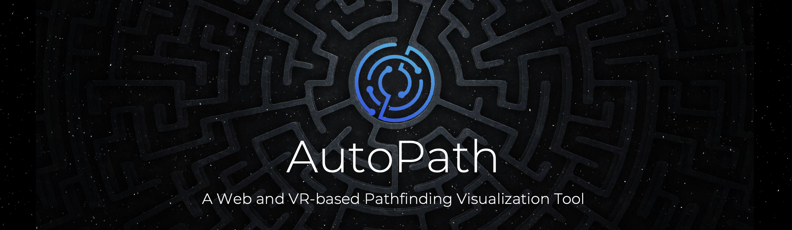

<div id="top"></div>
  
<div align="center">
  <br>
   

  
  [![Contributors][contributors-shield]][contributors-url]
  ![GitHub Top Language][shield-github-top-language]
  ![GitHub Latest Release][shield-github-latest-release]
  [![Last Commit][last-commit-shield]][last-commit-url]
  [![Issues][issues-shield]][issues-url]
  [![MIT License][license-shield]][license-url]
  
  <a href="https://github.com/comp195/senior-project-spring-2022-autopath/tree/master/documentation"><strong>Explore the docs »</strong></a>
  
</div>

<!-- TABLE OF CONTENTS -->
<details id="table_of_contents">
  <summary>Table of Contents</summary>

  - [About The Project](#about-the-projec)
    - [Built With](#built-with)
  - [Screenshots](#screenshots)
  - [Getting Started](#getting-started)
    - [Web](#web)
    - [VR](#vr)
  - [Roadmap](#roadmap)
  - [License](#license)
  - [Contact](#contact)
  - [Special Notes](#special-notes)
  - [Acknowledgments](#acknowledgments)

</details>

<!-- ABOUT THE PROJECT -->
## About The Project

![demo][demo]

AutoPath is a web and VR-based application that visualizes pathfinding algorithms in real time. Users have the ability to choose from a randomly generated maze, maze presets, or simply build what they want. AutoPath allows users to choose from algorithms such as Greedy Best-First Search, Dijkstra’s Algorithm, A* Search, Breadth-First Search, and Depth-First Search and visualize how the algorithm finds the path from a selected start point to a selected end point. Users are also allowed to create a custom maze which can be saved in their account for future use.

<p align="right">(<a href="#top">back to top</a>)</p>

### Built With


<div align="center">
  
  #### Web

  [![HTML][html-shield]][html-url]
  [![CSS][css-shield]][css-url]
  [![JavaScript][js-shield]][js-url]
  [![React][react-shield]][react-url]
  [![Node.js][node-shield]][node-url]
  [![Express][express-shield]][express-url]
  [![AWS][aws-shield]][aws-url]
  [![MySQL][mysql-shield]][mysql-url]
  
  <br>
  
  
  #### VR
  [![Unity][unity-shield]][unity-url]
  [![Oculus][oculus-shield]][oculus-url]
  
  <br>
  
  
</div>

<p align="right">(<a href="#top">back to top</a>)</p>

<!-- Screenshots -->
## Screenshots
<div align="center">
  
  ![demovr1][demovr1]
  ![demovr2][demovr2]
  ![demovr3][demovr3]
  
</div>

<p align="right">(<a href="#top">back to top</a>)</p>

<!-- GETTING STARTED -->
## Getting Started

### Web


#### Developer Installation
Get a local copy up and running follow these simple example steps.

1. Install npm
   ```sh
   npm install npm@latest -g
   ```
2. Clone the repo
   ```sh
   git clone https://github.com/comp195/senior-project-spring-2022-autopath.git
   ```
3. Install NPM packages
   ```sh
   npm install
   ```
   
#### Live Website

Check out the website here: [autopath](https://comp195.github.io/senior-project-spring-2022-autopath/)
<br><br>

### VR

An executable file for the VR: [autopath](https://github.com/comp195/senior-project-spring-2022-autopath/raw/master/VR/AutoPath.exe)

<p align="right">(<a href="#top">back to top</a>)</p>


<!-- ROADMAP -->
## Roadmap

- [x] Web - Login & Registration
- [x] Web - Create a 2D grid
- [x] Web - Add ability for users to add walls
- [x] Web - Develop random maze generation using recursive division
- [x] Web - Develop random maze generation using vertical division
- [x] Web - Develop random maze generation using horizontal division
- [x] Web - Develop random maze generation using random wall positions
- [x] Web - Enable pathfinding visualization for Djikstra
- [x] Web - Enable pathfinding visualization for A*
- [x] Web - Enable pathfinding visualization for BFS
- [x] Web - Enable pathfinding visualization for DFS
- [x] Web - Deploy website to AWS
- [x] Web - Integrate Node.js in AWS
- [x] VR - Design the virtual maze world
- [x] VR - Enable the ability for the user to roam around and interact with the world
- [x] VR - Random maze generation
- [x] VR - Enable pathfinding visualization for A*

See the [open issues](https://github.com/github_username/repo_name/issues) for a full list of proposed features (and known issues).

<p align="right">(<a href="#top">back to top</a>)</p>

                                
<!-- LICENSE -->
## License

Distributed under the MIT License. See `LICENSE.txt` for more information.

<p align="right">(<a href="#top">back to top</a>)</p>

                                
<!-- CONTACT -->
## Contact

  [![LinkedIn][linkedin-shield-bikram]][linkedin-url-bikram]
  [![LinkedIn][linkedin-shield-hung]][linkedin-url-hung]
  [![LinkedIn][linkedin-shield-lalit]][linkedin-url-lalit]

Bikram Chatterjee - b_chatterjee@u.pacific.edu

Hung Le - h_le21@u.pacific.edu 

Lait Vaidya - l_vaidya@u.pacific.edu

Project Link: [https://github.com/comp195/senior-project-spring-2022-autopath/](https://github.com/comp195/senior-project-spring-2022-autopath/)

<p align="right">(<a href="#top">back to top</a>)</p>

<!-- Special Notes -->
## Special Notes
* An Oculus Quest 2 will be used to test and use the VR application

<p align="right">(<a href="#top">back to top</a>)</p>
                                
<!-- ACKNOWLEDGMENTS -->
## Acknowledgments

* [A* Pathfinding - Aron Granberg](https://arongranberg.com/astar/)
* [AI Pathfinding - Unity](https://www.youtube.com/watch?v=TsB_6yjACDY)
* [Breadth First Search](https://www.geeksforgeeks.org/breadth-first-search-or-bfs-for-a-graph/)    
* [Depth First Search](https://www.geeksforgeeks.org/depth-first-search-or-dfs-for-a-graph/)
* [Express - Node.js web application framework.](https://expressjs.com/)
* [How to Deploy a Node.js application in AWS EC2 - AWS in Plain English. - Medium](https://aws.plainenglish.io/deploying-a-nodejs-application-in-awsec2c1618b9b3874)
* [React Tutorial](https://reactjs.org/tutorial/tutorial.html)
* [Research on Path-finding and Navigation Technology in VR Environment - P. Y. Yin and C. Yuan Li](https://ieeexplore.ieee.org/document/9262839)
* [XR Interaction Toolkit Documentation](https://docs.unity3d.com/Packages/com.unity.xr.interaction.toolkit@0.9/manua)

<p align="right">(<a href="#top">back to top</a>)</p>

<div align="center">
    <br><br>
    Made with ❤️ by i0nics
</div>


[aws-shield]: https://img.shields.io/badge/AWS-252f3d?style=for-the-badge&logo=amazon
[aws-url]: https://aws.amazon.com
[contributors-shield]: https://img.shields.io/github/contributors/comp195/senior-project-spring-2022-autopath.svg?style=for-the-badge
[contributors-url]: https://github.com/comp195/senior-project-spring-2022-autopath/graphs/contributors
[css-shield]: https://img.shields.io/badge/CSS-6597CC?style=for-the-badge&logo=CSS
[css-url]: https://www.w3schools.com/css/
[demo]: https://github.com/comp195/senior-project-spring-2022-autopath/blob/master/media/autopath-demo.gif
[demovr1]: https://github.com/comp195/senior-project-spring-2022-autopath/blob/master/media/vr_maze1.png
[demovr2]: https://github.com/comp195/senior-project-spring-2022-autopath/blob/master/media/vr_maze2.png
[demovr3]: https://github.com/comp195/senior-project-spring-2022-autopath/blob/master/media/vr_maze3.png
[express-shield]: https://img.shields.io/badge/Express-1D1F22?style=for-the-badge&logo=express
[express-url]: https://expressjs.com
[forks-shield]: https://img.shields.io/github/forks/comp195/senior-project-spring-2022-autopath.svg?style=for-the-badge
[forks-url]: https://github.com/comp195/senior-project-spring-2022-autopath/network/members
[html-shield]: https://img.shields.io/badge/HTML-D25634?style=for-the-badge&logo=HTML
[html-url]: https://developer.mozilla.org/en-US/docs/Web/HTML
[issues-shield]: https://img.shields.io/github/issues/comp195/senior-project-spring-2022-autopath.svg?style=for-the-badge
[issues-url]: https://github.com/comp195/senior-project-spring-2022-autopath/issues
[js-shield]: https://img.shields.io/badge/JavaScript-3f3f3f?style=for-the-badge&logo=javascript
[js-url]: https://www.javascript.com
[last-commit-shield]: https://img.shields.io/github/last-commit/comp195/senior-project-spring-2022-autopath?style=for-the-badge
[last-commit-url]: https://img.shields.io/github/last-commit/comp195/senior-project-spring-2022-autopath?style=for-the-badge
[license-shield]: https://img.shields.io/github/license/comp195/senior-project-spring-2022-autopath.svg?style=for-the-badge
[license-url]: https://github.com/comp195/senior-project-spring-2022-autopath/blob/master/LICENSE.txt
[linkedin-shield-bikram]: https://img.shields.io/badge/-LinkedIn_(Bikram_C.)-black.svg?style=for-the-badge&logo=linkedin&colorB=555
[linkedin-shield-hung]: https://img.shields.io/badge/-LinkedIn_(Hung_L.)-black.svg?style=for-the-badge&logo=linkedin&colorB=555
[linkedin-shield-lalit]: https://img.shields.io/badge/-LinkedIn_(Lalit_V.)-black.svg?style=for-the-badge&logo=linkedin&colorB=555
[linkedin-url-bikram]: https://linkedin.com/in/bikramce
[linkedin-url-hung]: https://www.linkedin.com/in/hungle12
[linkedin-url-lalit]: https://www.linkedin.com/in/lalit-vaidya
[mysql-shield]: https://img.shields.io/badge/MySQL-3f3f3f?style=for-the-badge&logo=mysql
[mysql-url]: https://www.mysql.com
[node-shield]: https://img.shields.io/badge/Node.js-263053?style=for-the-badge&logo=node.js
[node-url]: https://nodejs.org/en/
[oculus-shield]: https://img.shields.io/badge/Oculus-343434?style=for-the-badge&logo=oculus
[oculus-url]: https://www.oculus.com
[product-screenshot]: images/screenshot.png
[react-shield]: https://img.shields.io/badge/React-343434?style=for-the-badge&logo=react
[react-url]: https://www.react.com
[shield-github-latest-release]: https://img.shields.io/github/v/release/comp195/senior-project-spring-2022-autopath?include_prereleases&logo=github&style=for-the-badge
[shield-github-top-language]: https://img.shields.io/github/languages/top/comp195/senior-project-spring-2022-autopath?logo=github&style=for-the-badge
[unity-shield]: https://img.shields.io/badge/Unity-343434?style=for-the-badge&logo=unity
[unity-url]: https://www.unity.com
