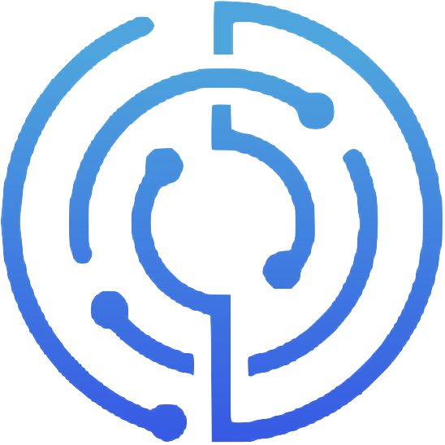

<div id="top"></div>

[![Contributors][contributors-shield]][contributors-url]
[![Issues][issues-shield]][issues-url]
[![MIT License][license-shield]][license-url]
[![Last Commit][last-commit-shield]][last-commit-url]


<div align="center">
  

  # AutoPath
  #### A Web and VR-based Pathfinding Visualization Tool
  
  <a href="https://github.com/comp195/senior-project-spring-2022-autopath/tree/master/documentation"><strong>Explore the docs »</strong></a>
  
</div>


<!-- TABLE OF CONTENTS -->
<details>
  <summary>Table of Contents</summary>
  <ol>
    <li>
      <a href="#about-the-project">About The Project</a>
      <ul>
        <li><a href="#built-with">Built With</a></li>
      </ul>Cancel changes
    </li>
    <li>
      <a href="#getting-started">Getting Started</a>
      <ul>
        <li><a href="#prerequisites">Prerequisites</a></li>
        <li><a href="#installation">Installation</a></li>
      </ul>
    </li>
    <li><a href="#roadmap">Roadmap</a></li>
    <li><a href="#license">License</a></li>
    <li><a href="#contact">Contact</a></li>
    <li><a href="#acknowledgments">Acknowledgments</a></li>
  </ol>
</details>


<!-- ABOUT THE PROJECT -->
## About The Project

[![Product Name Screen Shot][product-screenshot]](https://example.com)

AutoPath is a web and VR application that visualizes pathfinding algorithms in real time. At its core, AutoPath seeks to assist learners h the shortest path between two points. It gives users the ability to choose from a randomly generated maze, maze presets, or simply build what they want. AutoPath offers algorithms such as Greedy Best-First Search, Dijkstra’s Algorithm, A* Search, Breadth-First Search, and Depth-First Search for users to choose from. The application also allows users to create an account to save their custom mazes for access later or sign in as a guest for quicker access.

<p align="right">(<a href="#top">back to top</a>)</p>


### Built With

* [React.js](https://reactjs.org/)
* [Bootstrap](https://getbootstrap.com)
* [JQuery](https://jquery.com)
* [JavaScript]()

<p align="right">(<a href="#top">back to top</a>)</p>


<!-- GETTING STARTED -->
## Getting Started

Get a local copy up and running follow these simple example steps.

### Prerequisites

* npm
  ```sh
  npm install npm@latest -g
  ```

### Installation

1. Clone the repo
   ```sh
   git clone https://github.com/comp195/senior-project-spring-2022-autopath.git
   ```
2. Install NPM packages
   ```sh
   npm install
   ```
3. Double click on index.html

<p align="right">(<a href="#top">back to top</a>)</p>


<!-- ROADMAP -->
## Roadmap

- [ ] Web - Create an expandable 2D grid
- [ ] Web - Add ability for users to add their own start and stop locations
- [ ] Web - Add ability for users to add their nodes and walls
- [ ] Web - Develop random maze generation
- [ ] Web - Enable pathfinding visualization for A*, Djikstra, BFS, and DFS to name a few
- [ ] Web - Deploy website to AWS
- [ ] VR - Design the virtual maze world
- [ ] VR - Enable the ability for the user to roam around and interact with the world
- [ ] VR - Random maze generation
- [ ] VR - Enable pathfinding visualization for A*, Djikstra, BFS, and DFS to name a few

See the [open issues](https://github.com/github_username/repo_name/issues) for a full list of proposed features (and known issues).

<p align="right">(<a href="#top">back to top</a>)</p>


<!-- LICENSE -->
## License

Distributed under the MIT License. See `LICENSE.txt` for more information.

<p align="right">(<a href="#top">back to top</a>)</p>


<!-- CONTACT -->
## Contact

Bikram Chatterjee - b_chatterjee@u.pacific.edu [![LinkedIn][linkedin-shield]][linkedin-url-bikram]

Lait Vaidya - l_vaidya@u.pacific.edu [![LinkedIn][linkedin-shield]][linkedin-url-lalit]
 
Hung Le - h_le21@u.pacific.edu [![LinkedIn][linkedin-shield]][linkedin-url-hung]

Project Link: [https://github.com/comp195/senior-project-spring-2022-autopath/](https://github.com/comp195/senior-project-spring-2022-autopath/)

<p align="right">(<a href="#top">back to top</a>)</p>


<!-- ACKNOWLEDGMENTS -->
## Acknowledgments

* [Express - Node.js web application framework.] (Express - Node.js web application framework.)
* [How to Deploy a Node.js application in AWS EC2 - AWS in Plain English. - Medium](https://aws.plainenglish.io/deploying-a-nodejs-application-in-aws-ec2-c1618b9
b3874)
* [XR Interaction Toolkit](https://docs.unity3d.com/Packages/com.unity.xr.interaction.toolkit@0.9/manua)
* [virtualenv](https://virtualenv.pypa.io/en/latest/#using-virtualenv-without-bin-python)

<p align="right">(<a href="#top">back to top</a>)</p>

<div align="center">
    <br><br>
    Made with ❤️ by i0nics
</div>


<!-- MARKDOWN LINKS & IMAGES -->
<!-- https://www.markdownguide.org/basic-syntax/#reference-style-links -->
[contributors-shield]: https://img.shields.io/github/contributors/comp195/senior-project-spring-2022-autopath.svg?style=for-the-badge
[contributors-url]: https://github.com/comp195/senior-project-spring-2022-autopath/graphs/contributors
[forks-shield]: https://img.shields.io/github/forks/comp195/senior-project-spring-2022-autopath.svg?style=for-the-badge
[forks-url]: https://github.com/comp195/senior-project-spring-2022-autopath/network/members
[stars-shield]: https://img.shields.io/github/stars/comp195/senior-project-spring-2022-autopath.svg?style=for-the-badge
[stars-url]: https://github.com/comp195/senior-project-spring-2022-autopath/stargazers
[issues-shield]: https://img.shields.io/github/issues/comp195/senior-project-spring-2022-autopath.svg?style=for-the-badge
[issues-url]: https://github.com/comp195/senior-project-spring-2022-autopath/issues
[last-commit-shield]: https://img.shields.io/github/last-commit/comp195/senior-project-spring-2022-autopath?style=for-the-badge
[last-commit-url]: https://img.shields.io/github/last-commit/comp195/senior-project-spring-2022-autopath?style=for-the-badge
[license-shield]: https://img.shields.io/github/license/comp195/senior-project-spring-2022-autopath.svg?style=for-the-badge
[license-url]: https://github.com/comp195/senior-project-spring-2022-autopath/blob/master/LICENSE.txt
[linkedin-shield]: https://img.shields.io/badge/-LinkedIn-black.svg?style=for-the-badge&logo=linkedin&colorB=555
[linkedin-url-bikram]: https://linkedin.com/in/bikramce
[linkedin-url-lalit]: https://www.linkedin.com/in/lalit-vaidya
[linkedin-url-hung]: https://www.linkedin.com/in/hungle12
[product-screenshot]: images/screenshot.png
